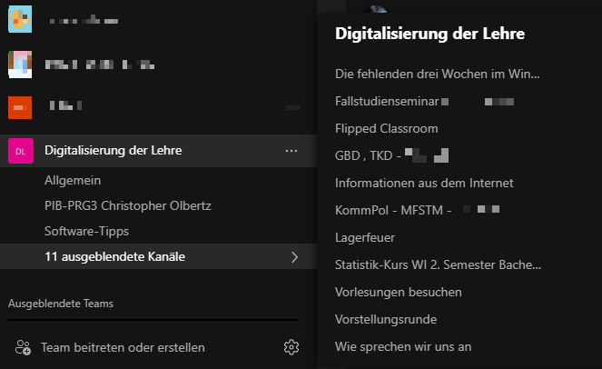

# Digitaler Studienbeginn und Studienerfolg während der Corona-Pandemie und in der Zukunft

## Einführung: Das digitale erste Semester
### Zentrales Informationsportal

Übersichtsseite für Erstsemester und Navigationsstruktur (links)

Startseite des Informationsportals mit Navigationsstruktur

Die Tutorial-Videoreihe haben wir mit einem kleinen Augenzwinkern „STLFLIX“ getauft,um die Akzeptanz beim jungen Zielpublikum zu erhöhen und den Studierenden in den schweren Zeiten einen Studieneinstieg mit einem Lächeln zu ermöglichen. Nicht zwingend akademisch-seriöser, aber zielgruppengerechter Humor ;-)

Zugriffsstatistiken auf das Informationsportal zum Semester- bzw. Vorlesungsbeginn

### Durchführung von digitalen Kennenlern-Aktivitäten für Erstsemester
Digitale Kennenlern-Aktivitäten für Erstsemester, anonymisiertes Vorstellungsforum in PIB-BWL zur Veranschaulichung der hohen Beteiligung (insgesamt 87 Beiträge mit Vorstellungen)

Interaktive Website für die live Kennenlernen-Fragerunde

## Durchführung: Digitale Lehre und Infrastruktur
### Virtueller Rechnerraum für digitale Lehrveranstaltungen

### Technisch-didaktische Umsetzung von digitalen, interaktiven Lehrveranstaltungen
Ausgewählte Szenen digitaler Lehre:

Eine am regulären Arbeitsplatz benutzbare und auch bezahlbare Version (<500 EUR) sah dann so aus:

Vereinfachte Darstellung des Gesamtsystems zum Streaming der Lehrveranstaltungen. Hierfür wurde ein handelsüblicher, ein paar Jahre alter PC verwendet (<1k EUR), der lediglich vom Arbeitsspeicher etwas aufgerüstet werden musste, um die Vielzahl der gleichzeitig laufenden Anwendungen
ruckelfrei bedienen zu können (32GB RAM):

## Multiplikation: Wissenstransfer innerhalb der Hochschule
Übersicht der Themen („Channels“) im Austausch-Team

